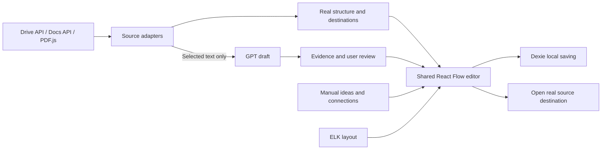

# GraphNav: use cases, features, and integration contracts

This specification connects the product described in [IDEA](./IDEA.md) to concrete implementation and acceptance work.
It supplements [BUILD_PLAN](./BUILD_PLAN.md), which defines sequence and ownership.
[TASK_LIST](./TASK_LIST.md) remains the only task-status list.
A feature appearing here is a requirement or proposed implementation, not a claim that it works.

## What the audit corrected

The earlier plan described delivery stages but did not fully trace each user workflow to its tools, controls, data, and tests.
It also treated some original authoring requirements as deferred without providing an explicit task or an agreed delivery decision.
Folder creation, Doc tab creation/renaming, grouped relationships, selected cross-source maps, and movable panel placement must stay visible in the plan.
The original IDEA at `91275ef` included author actions and at least one real source creation demonstration if authorization worked.
The later plan's blanket deferral is not evidence that the user dropped those requirements.

Three coverage labels keep the promise honest:

- **Core:** required for the currently targeted V1 + V2 navigation MVP, including Drive, Docs, a text PDF, manual editing, real AI review, and durable saving.
- **Completion:** part of the broader described product, with an explicit task and implementation below; its delivery order follows BUILD_PLAN and the 4 PM submission deadline.
  This label does not mean the user approved removing it.
- **Expansion:** additional formats, integrations, and public-service capabilities beyond the bounded prototype.

Do not describe all applications as complete unless their acceptance cases pass.
The user removed the 6 AM freeze; the remaining work still requires implementation and verification rather than schedule-only completion.

## Required assisted creation, including manual mode

The user explicitly requires source suggestions and autofill before GPT integration.
Existing Drive folders/files, Doc tabs/sub-tabs, and parsed PDF sections/pages are ready-to-add node candidates.
Manual means the user chooses nodes and connections; it must not mean retyping known titles or copying URLs.

1. After authorization, opening Graph on a supported page restores the saved map and offers suggestions from the current source.
   On an authenticated Google source with no saved map, create its bounded structural baseline automatically without GPT.
   Drive Home opens the My Drive root graph; a specific folder or Doc has its own map.
   Preserve an explicitly selected project map, and offer This page to return to the cached source map.
   Sources offers a blank selected-only map when users want to choose every member themselves.
2. Add existing items opens a reusable chooser with current items, parent/path context, search within the disclosed scope, multi-select, Add selected, and Already added indicators.
   Selecting a real item fills its label/type/destination from the source response.
3. Build baseline previews the scope and imports its structure with one action, including names and real destinations.
   It uses source APIs or PDF parsing and works with the AI relay stopped.
4. Generate with AI separately analyzes selected text to propose meaningful concepts and connections for review.
   Baseline creation is already automatic without GPT; V2 adds content interpretation.
5. Every result remains editable in the same on-page graph or PDF reader, including personal labels/notes, connections, layout, and adding more existing items later.

Use source order and proximity to the current folder/tab to rank initial candidates deterministically.
Do not present name matching as an AI inference or claim discovery of unseen content.
Show both title and context for identical names; key candidates by account/source/locator identity, never title.
Opening or filtering the picker is read-only with respect to live graph membership.
No-match state offers a new personal idea; source creation is a separate X3 action.

### Candidate and selection contract

N1-B owns the shared candidate contract and Drive implementation; M3-B and M4-B supply Docs/PDF candidates through the same interface.
N1-A owns the shared chooser; M3-A and M4-A integrate it in those surfaces.
These are proposed contract fields, not already shipped messages.

| Object / operation | Required fields and behavior |
| --- | --- |
| Candidate | Stable candidate key, verified account/source context, provider resource ID, typed locator, source title, display kind, parent/path context, and permitted capabilities |
| Candidate page | Items, cursor, scope label, freshness, complete/partial state; listing does not persist live nodes |
| Add selected | Target graph ID, expected revision, selected candidate identities, request ID, optional deliberate personal overrides; worker revalidates identity/account and persists atomically |
| Build baseline | Explicit source and bounded outline scope, target/new-map choice, root/parent preview, and completion/continuation state |
| Saved membership | Distinguish an explicitly selected set from a baseline outline; version/default the new binding fields deliberately and test existing maps/backups |

Already added is derived from the target graph and canonical locator identity, not a stale global picker flag.
Re-adding an existing candidate selects or unhides it only through a clear user action; it never duplicates a source node or overwrites its personal label/layout.
Add selected imports only chosen items and previewed structural context, without fabricating containment to unselected parents.
Refreshing a selected-only binding updates those records without silently importing all source siblings.
Do not reuse a destructive complete-folder reconciliation for a hand-selected subset.
A source rename updates the base title while personal overrides remain intact.

**Acceptance without GPT:** select existing items without typing titles/URLs; distinguish equal titles; add twice without duplicates; cancel without changing membership; keep previous manual edits; load another result page; reject a wrong-account candidate; refresh without adding unselected siblings.
Repeat this workflow in Drive, nested Docs tabs, and PDF sections at their integration gates.

## User workflow coverage

Each row defines an observable result, the implementation used, and the task owners.
A tasks belong to Rajvansh and B tasks belong to Eddy.

| Case | User and desired result | Features and integration | Owner tasks | Coverage and acceptance |
| --- | --- | --- | --- | --- |
| UC-01 | Start planning before any files exist | Blank map; idea/note nodes; editable labels/notes; several labeled connections per node; later attach a source; map chooser | M2-A, M2-B, M5-A, M5-B | Core: create an idea without Google, connect it to two nodes, attach a real destination later, reopen unchanged |
| UC-02 | Open an existing Drive folder as a map | Current-source suggestions and autofill; select individual items or build a baseline; root/file/folder nodes; expand/collapse; paginated child reads; separate Expand and Open actions; explicit Refresh | N1-A, N1-B, M2-A, M2-B | Core: source suggestions/autofill and an editable baseline work with GPT off; ten demo children plus root; expand the nested folder; open a real file; partial loading preserves unseen personal work |
| UC-03 | Work in a Doc while using its graph | Reusable left graph panel; ready-to-add top/nested tab suggestions and autofilled destinations; baseline map; current-tab indicator; same-browser-tab navigation; source remains editable | M3-A, M3-B | Core: click all four demo tabs including the nested one; type and scroll normally; no required My maps detour |
| UC-04 | Understand content inside tabs, not just tab names | Docs paragraphs, headings, table text, and explicit links become anchored passages; selected text can produce concept nodes and semantic links | G1-A, G1-B, G2-A, G2-B, G3-A, G3-B | Core: concepts cite actual content in two selected tabs; clicking evidence reaches the correct tab and shows the excerpt; tab-title import alone fails this case |
| UC-05 | Read someone else's accessible paper | Local PDF picker; our reader beside the shared graph; selectable/autofilled bookmark/section/page nodes and baseline; preview; exact page jumps; personal notes | M4-A, M4-B | Core: author need not install GraphNav; three jumps land correctly; PDF and personal graph reopen together |
| UC-06 | Ask AI to build a useful editable map | Select Doc tabs or PDF pages; preview scope; generate concepts and supported relationships; evidence; accept/edit/reject | G0-A through G4-B | Core: real Doc and PDF runs produce inspectable non-containment links; reviewed work persists through regeneration |
| UC-07 | Make connections beyond a tree | Arbitrary pairwise links including cycles; labels such as supports, depends on, addresses; node may connect to many others | M2-A, M2-B | Core: connect one idea to three existing nodes across branches; no forced single parent for personal relationships |
| UC-08 | Express one relationship involving several things | Member selector with From/To or peer roles; one labeled junction with spokes; add/remove members without expanding into false pairwise claims | X1-A, X1-B | Completion: Budget + Staff jointly constrain Launch; edit members, save, reopen, and remove a member without corrupting the graph |
| UC-09 | Use a folder, Doc, and PDF in one project map | Add existing source to this map; typed attachment picker; canonical-source reuse; multiple bindings; every link resolves through its adapter | X2-A, X2-B | Completion: connect a Doc tab to a PDF section in one chosen map while a separate paper map remains independent |
| UC-10 | Create real structure while authoring | Explicit Create folder, Add tab, Rename tab actions; capability checks; additional OAuth grant; read back real returned IDs | X3-A, X3-B | Completion: authorized demo folder/tab creation and tab rename appear in Google; a read-only user can still edit their personal graph |
| UC-11 | Move or resize the browser graph | Left/right docking and bounded resize; separate graph pan/zoom; saved preference; optional floating drag placement | M3-A, M5-A, M5-B; X4-A, X4-B for floating | Core: dock/width restores and close stays reachable at zoom; Completion: floating placement restores and clamps after viewport changes |
| UC-12 | Return tomorrow or refresh changed sources | Stable IDs; imported base separate from personal edits; save indicator; source freshness; account scope; missing/stale destination state | M5-A, M5-B | Core: rename source, move a folder child, revoke access, restart Chrome, refresh; notes/links/layout remain and unavailable targets are not silently retargeted |
| UC-13 | Navigate a larger collection without a hairball | ELK initial arrangement; manual pinning; local focus; collapsed containment; search; Show more; incremental cache; outline fallback | M2-A, M2-B, M6-A, M6-B | Core: bounded 50-node canvas remains usable on a labeled 500-node fixture; a search can reveal a matching loaded node outside the initial view |
| UC-14 | Recover work and keep private maps local | Extension-owned Dexie database; versioned export/import; visible failures; PDF byte storage/reattach; safe migration; local offline personal edits | M5-A, M5-B, M4-B, G3-B, M6-B | Core: full browser restart and backup restore preserve edits; quota failure reports unsaved state; imported copies have independent IDs |
| UC-15 | Read other file types or management applications | MIME capability registry; unsupported files still open as links; a separate adapter supplies structure/text/navigation per additional provider | X5-A, X5-B | Expansion: choose each new provider/format explicitly; prove its authorized read, locator, refresh, and permission cases before advertising support |
| UC-16 | Install without a developer laptop or share maps live | Packaged extension; hosted authenticated AI relay; public Google consent/release process; optional later graph synchronization/conflicts | X6-A, X6-B | Expansion: separate release track; two-laptop local storage and a local AI server do not establish public installation or collaboration |

## How the pieces connect

The same editor accepts imported structure, manual work, and reviewed AI suggestions.
The original Google document remains in Google's editor; the PDF stays visible in our reader.

## Chosen tools and what each actually does

Keep the existing stack and separate the integrations behind small typed interfaces.
Adding a dependency does not implement its associated feature.

| Tool | Responsibility | Concrete integration and present boundary |
| --- | --- | --- |
| WXT + Manifest V3 + TypeScript | Build and package one Chrome extension | Existing content script, popup, workspace, and service worker; add an extension-owned PDF reader; preserve the stable manifest key |
| React + existing Tailwind/CSS | Panels, forms, node details, source chooser, evidence review | Extract the existing personal editor into reusable controls; compact toolbar and collapsible inspector in the Google panel |
| `@xyflow/react` / React Flow | Interactive nodes, edges, selection, dragging, zoom, keyboard controls | Already installed; use custom source/idea/junction nodes and edge styles; add drag-to-connect plus accessible form fallback |
| `elkjs` / ELK | Calculate readable initial node positions | Planned dependency; layered layout of visible structure in a bundled worker; fit new nodes around preserved manual positions; not a semantic connection engine |
| Chrome Identity + authorized REST `fetch` | Google authorization and source requests | Eddy's worker owns tokens; Drive/Docs page scripts send validated requests; no token passed to Google page JavaScript |
| Drive API v3 | Folder/file metadata, children, capability checks, permitted author actions | `files.list`, `files.get`, `about.get`; `files.create` for explicit folder creation under X3; metadata reads do not read file contents |
| Docs API v1 | Tab hierarchy, text, headings, links, permitted tab actions | `documents.get` with `includeTabsContent=true`; traverse `childTabs` and `documentTab`; `documents.batchUpdate` for X3 author actions |
| `pdfjs-dist` / PDF.js | Parse/render local PDF bytes, text, outlines, destinations | Planned dependency with bundled worker; use page-aware text extraction and our reader rather than modifying Chrome's built-in viewer |
| IndexedDB + Dexie | Local graph records, personal overrides, view, cache, PDF bytes | Existing repository with eight stores; add generation decision persistence through an additive migration; no AWS setup |
| Zod | Validate messages, saved records, backups, generation inputs/outputs | Already installed; runtime validation remains necessary even when TypeScript and structured model output are used |
| Node.js + TypeScript + official `openai` SDK | Small AI relay calling the Responses API | Planned separate relay package; `responses.parse` with `zodTextFormat` where compatible; server environment holds API key; actual model ID chosen after project smoke test |
| Playwright + fake-indexeddb | Browser and repository regression checks | Existing foundation; add end-user Google/PDF/AI cases and explicit real-account checks; fixtures do not prove live integration |

React Flow supports integration with an external layout engine; ELK provides asynchronous layout and worker support.
These roles remain separate from graph meaning and persistence.
[React Flow layout documentation](https://reactflow.dev/learn/layouting/layouting), [ELK JavaScript documentation](https://github.com/kieler/elkjs).

No embedding database, graph database, orchestration framework, or full-source crawler is needed for the selected-content MVP.
A graph is stored as node records plus relationship membership; it does not require Neo4j.
Future collection-wide retrieval can add indexing after selected-source generation is useful and measured.

## Reusable interface and navigation behavior

The panel must contain the actual editor, not only connection status or a button to a separate workspace.
Use one controller for graph commands with two transports: direct extension-origin repository access for workspace/reader, and typed background messages for Google content scripts.
Only the transport and source context differ between surfaces.

- Keep the canvas primary and Close reachable.
  The compact toolbar opens Sources, Add idea, Connect, AI and More; source import/refresh, map selection/backups and panel settings live in focused drawers or menus.
  This page visibly restores the source map; search and Arrange map remain beside the canvas.
- Canvas: distinguish folders, documents, tabs, PDF sections, ideas, and relationship junctions using icons and labels, not color alone.
- Source node titles navigate directly; Edit opens the inspector and two node Connect clicks create a relationship without dragging.
  Clicking a personal node edits it, and clicking a relationship label edits that connection.
  Dragging never opens or moves a source.
  Folder navigation keeps the browser tab and the overlay open with the destination folder map; Doc tab navigation keeps the existing Doc browser tab.
- Inspector: editable personal label/notes; source title/type; destination; relationship explanation; evidence excerpt and provenance; hide versus remove with clear effects.
- Explore: focus, expand, collapse, search, and open; Build: create/edit/connect controls, with source-write actions only when allowed.
- Recovery: undo the last personal deletion where practical or offer an explicit confirmation; never imply that graph undo reverses a Google write.
- Small viewport: collapse the inspector; preserve meaningful canvas space, keyboard access, visible loading/error state, and reachable X/Escape.

Cycle-safe neighborhood traversal is required for focus and search.
Collapse applies to displayed source containment and does not delete personal links or recursively follow arbitrary semantic cycles.
Pinned nodes keep their coordinates during expansion and Refresh; do not assume ELK itself preserves arbitrary pins without application logic.
Search must say whether it covers the loaded map or provider results.
Do not label local loaded-node search as searching all of Drive or the full text of every document.

## Files and message handoff

Preserve Eddy's single dispatcher and the existing repository; do not create a second background worker or another schema.
These are contract requirements to agree before implementation, not names of commands already shipped.

| Boundary | Concrete change | Owner and test |
| --- | --- | --- |
| `components/ExtensionShell.tsx`, `components/graph/GraphCanvas.tsx`, workspace UI | Extract shared editor/controller; mount in Drive/Docs; retain existing workspace; add compact inspector, connection handlers, layout/focus behavior | Rajvansh M2-A/M3-A; same map edits through both surfaces |
| `lib/messages.ts`, request validator, `entrypoints/background.ts` | Reuse ACCOUNT_KEY, IMPORT_DRIVE_FOLDER, IMPORT_DOC_TABS, LIST_GRAPHS, READ_GRAPH; add typed edit/layout/view/refresh/backup operations | Eddy M2-B/M5-B; reject malformed, wrong-account, wrong-origin, stale-revision, and out-of-graph references |
| Navigation request | Explicit disposition for current source tab versus new destination; bind current-Doc navigation to the verified sender/source browser tab | Eddy M3-B; Rajvansh verifies actual nested-tab change and preserved editing |
| `lib/graph/types.ts`, `lib/storage/*` | Coordinate additive proposal/origin/locator upgrades; preserve existing member-list and source/personal separation | Eddy after M1-C review, Rajvansh reviews; migrate real version-1 fixtures and older backups |
| Proposed `lib/content/*`, `lib/generation/*`, relay package | Shared input/draft Zod schema; selected-content extraction; real model request; validate before preview and before applying | Eddy G1-B/G2-B/G3-B, Rajvansh consumes; malformed/cancelled/stale output cannot mutate graphs |
| Proposed reader entrypoint and PDF adapter | One bundled PDF.js version/worker shared by parser and viewer; typed page navigation; keep bytes outside messages where possible | Rajvansh coordinates root lockfile; Eddy owns adapter contract; reopen and three-page jump tests |

Background replies distinguish data, unsupported operation, authorization required, unavailable source, conflict, and recoverable failure.
Use request IDs and make repeated import/accept actions idempotent so a double click or retry cannot create duplicates.
Google read errors do not erase saved personal work, and any persisted data returned to a Google page must be authorized for that source/account context.

## Source extraction contracts

### Drive: source structure and selected readable content

Call `files.list` with a parent query, a non-trashed filter, requested fields, and the continuation token.
Preserve each real ID, title, MIME type, parent relation, and available open target.
Read `files.get` for a root or destination when metadata/capabilities are needed.
Use the verified account key in graph lookup and cache keys; avoid duplicate default maps under concurrent import.
A partial page, permission error, or UI limit is not a complete source snapshot.
[Drive files.list reference](https://developers.google.com/workspace/drive/api/reference/rest/v3/files/list).

The capability registry reports three independent capabilities: can navigate, can extract text, can write source.
A spreadsheet/image/archive can initially be an openable file node without being AI-readable.
Selecting a Google Doc invokes the Docs extractor; selecting a local PDF invokes the PDF extractor.
Reading PDF bytes from Drive later requires a separate authorized download path and potentially additional scope; the existing metadata scope is insufficient.
Google shortcuts need a typed target or a clearly labeled open-only fallback, not a fake empty folder.

### Docs: structure, paragraphs, and real anchors

Fetch the document with `includeTabsContent=true`, recurse `childTabs`, and extract from each selected `documentTab`.
Build passages from paragraphs and recursively from table cells in document order; retain heading metadata, tab identity, and source version/content hash.
Record explicit links as references when their targets can be resolved, keeping external link targets separate from automatically fetched content.
Header/footer/footnote/image text must be identified as included or unsupported; never claim the full document was read when only body text was extracted.
The API exposes tab-aware heading/bookmark links; account for these when resolving explicit references.
[Google Docs tab guide](https://developers.google.com/workspace/docs/api/how-tos/tabs).

Store passage offsets for validation, not as a promise that the Google editor accepts arbitrary character-offset navigation.
The core evidence destination is the exact Doc tab plus a displayed excerpt.
Heading/bookmark deep links belong to X7 and require installed-Chrome verification; retain a tab fallback when an anchor disappears.
The current locator schema has document/tab IDs but no heading or paragraph anchor variant.
Do not claim paragraph highlighting without that schema, navigation implementation, and test.

### PDF: one parsing pipeline for navigation and AI

Use `getDocument` on selected bytes, `getOutline` for bookmarks, and `getDestination`/`getPageIndex` to resolve outline destinations.
Render the requested page using `getPage`; use `getTextContent` to build passages retaining page and text-position metadata.
PDF.js page requests use one-based page numbers while our locators store zero-based `pageIndex`; convert explicitly at the boundary.
[PDF document API](https://mozilla.github.io/pdf.js/api/draft/module-pdfjsLib-PDFDocumentProxy.html), [PDF page API](https://mozilla.github.io/pdf.js/api/draft/module-pdfjsLib-PDFPageProxy.html).

Use bookmarks first, text-heading candidates second, and an honest page outline fallback.
Allow the user to correct a section label/anchor.
Text extraction is not guaranteed to recover reading order from multi-column layouts; inspect the demo's extracted text before calling it supported.
Empty text, encrypted/unsupported files, and oversized files need clear states.
OCR is an expansion, not an implicit capability of PDF.js.
Paper arguments or claims may be proposed from selected readable text using the same evidence review; this is not comprehensive citation discovery or factual verification.

## How a tree becomes a graph with meaning

There are three independent ways to add connections:

1. **Imported fact:** a folder contains a file, a Doc contains a tab, or a paragraph explicitly links to another source.
2. **Personal interpretation:** the user connects any relevant nodes and labels the relationship.
3. **AI proposal:** the model reads selected passages and proposes a concept or relationship with supporting evidence for review.

For example, two tabs named Budget and Launch initially produce two containment links from the document.
If selected text says funding must be approved before launch, AI may propose `Budget approval -> required before -> Launch` with the relevant excerpts.
The user can instead draw that connection manually, change the wording, or reject it.
A valid JSON response is not proof that the interpretation is correct.

Choose node granularity deliberately: source nodes represent navigable things; passage anchors identify evidence; concept nodes represent a meaningful idea, decision, claim, or question.
Do not create one node per sentence or make a concept's title its identity.
One concept can cite several passages or sources, and one source can support several concepts.
Concepts are personal graph records after acceptance; refreshing a source does not erase them.

### Generation protocol

| Stage | Input/output and constraints | Ownership |
| --- | --- | --- |
| Select | User chooses supported tabs/pages and purpose: navigation overview or concept connections; preview selected text and size | G1-A UI, G1-B extraction |
| Normalize | `SourcePassage` records carry passage ID, source/account identity, version/hash, locator, and text; include relevant existing graph IDs and prior decisions | G1-B; Rajvansh reviews contract |
| Request | One explicit action; initially one Doc or PDF, at most 20,000 characters; one active request and 60-second timeout; local relay validates limits | G0-B, G2-A, G2-B |
| Propose | Versioned draft with temporary node IDs, proposed labels/types, allowed existing-node references, relationship labels/direction, short rationale, and evidence IDs/excerpts | G2-B |
| Validate | Enforce shape, counts, selected-source boundaries, unique IDs, resolvable members, excerpt existence, and current input hash; handle refusal/incomplete/empty results | G2-B, G4-B |
| Review | Show draft distinctly; inspect source excerpt; accept/edit/reject individually or accept selected valid proposals | G3-A |
| Apply | One transaction maps temporary IDs, applies accepted records, persists provenance/decision, and checks graph revision; no partial acceptance | G3-B |
| Repeat | Preserve personal edits and exact previous decisions; suppress exact repeats; mark changed-source evidence stale; never silently auto-apply a new draft | G3-B, G4-A, G4-B |

The Responses API and structured outputs provide the typed proposal mechanism, with application validation and user review completing the workflow.
[Official Structured Outputs documentation](https://developers.openai.com/api/docs/guides/structured-outputs).

AI output cannot create Google folders, modify document text, execute tools, or invent navigation URLs.
Resolve destinations from validated source references in application code.
Keep the model key on the relay, use authenticated loopback access and an exact-origin allowlist, cap request sizes, and keep manual maps usable if the relay is offline.
The existing graph origin enum does not include AI and there is no proposal store yet; G3-B must migrate both records and backups before claiming provenance persistence.

## Stored information and invariants

Keep the existing eight-store design; extend it only where a tested workflow requires it.

| Store / record | What it keeps | Required invariant |
| --- | --- | --- |
| `graphs` | Map ID/name, bindings, account context, revision, pan/zoom | Independent maps have independent edits; lookup uses account plus binding, never only a URL/title |
| `sources` | Provider/account/resource identity, source title, version, availability | Rename changes title, not identity; a cached source does not grant permission |
| `nodes` | Source/idea/note records, typed destination, evidence | Position is separate; a concept can have multiple evidence anchors; links do not depend on display labels |
| `relationships` | Membership with direction/roles, kind, label, origin, evidence | Multiple links and cycles are valid; members must belong to the same graph; group semantics remain one record |
| `itemEdits` | Personal labels, notes, hidden state | Refresh changes imported base information without overwriting these values |
| `layoutItems` | Coordinates and manual pinning | Re-layout cannot casually move user-arranged items |
| `sourceCache` | Reconstructible structure/text chunks, version, size, last access | Account/source/version scoped; eviction cannot remove personal work |
| `blobs` | PDF bytes and byte identity | Stored outside graph JSON; graph locators and attachments must agree on fingerprint |
| Planned `generationRuns` | Draft proposals, review decisions, evidence/input version, accepted record IDs | Additive Dexie upgrade; failed request or rejected draft cannot change live graph records |
| Small panel preferences | Dock, width, optional floating rectangle, last selected map per surface | Extension-owned settings separate from graph coordinates; restore within the current viewport |

Google page scripts must access these records through the extension worker because direct content-script IndexedDB uses the website's origin.
Extension pages and the worker share the extension storage origin.
[Chrome storage documentation](https://developer.chrome.com/docs/extensions/develop/concepts/storage-and-cookies).
Use additive schema upgrades and preserve old records/backups.
[Dexie upgrade documentation](https://dexie.org/docs/Version/Version.upgrade()).

For a selected multi-source map, import source-backed nodes into the target graph and reuse canonical source records.
Do not create dangling cross-graph relationship members.
Allow one verified Google account plus local sources initially; joining multiple Google accounts requires a later authorization design.
A Drive file and its Docs content can share the Google file identity while retaining provider-specific locators; reconcile explicitly rather than merging equal titles.

Current backup version 1 contains graph records, not PDF bytes or generation runs.
M4-B/G3-B must add explicit attachment/decision behavior while continuing to import version 1.
For the first PDF backup, export graph/evidence and require the user to keep or reattach the exact original PDF, with a visible warning and fingerprint check.
Do not claim a standalone PDF backup until a packaged attachment export is implemented.

## Completion work that the old plan hid

These tasks remain part of the intended-product discussion and have paired rows in TASK_LIST.
They cannot be silently counted as implemented by a flexible schema or renderer.

| Tasks | Concrete integration | Gate or account action |
| --- | --- | --- |
| X1-A / X1-B | Group member editor using existing member-list storage and junction renderer; test directed and peer groups and member deletion | No new service required; complete a manual group workflow |
| X2-A / X2-B | Add-source picker, binding/import into an existing graph, deduplicated source references; then bounded multi-source AI selection | Agree contract before changing importer; first prove manual Doc-to-PDF linking; keep request limits |
| X3-A / X3-B | `files.create` with folder MIME type and chosen parent; `documents.batchUpdate` with `addDocumentTab` and `updateDocumentTabProperties`; explicit readback and refresh | Eddy prepares minimal scope/capability change; account owner grants write access and authorizes demo writes; never infer write access from current read scopes |
| X4-A / X4-B | Optional floating panel via pointer events; saved rectangle, resize/dock reset, visualViewport clamping | Preserve tested popover top layer, Escape, focus, and host editing |
| X7-A / X7-B | Heading/bookmark source nodes and tab-aware locators with verified Google deep-link navigation; stale anchor fallback | Live Chrome behavior test before promising paragraph-level navigation |

Drive supports explicit folder creation, and Docs exposes the tab update requests above.
[Drive folder guide](https://developers.google.com/workspace/drive/api/guides/folder), [Docs request reference](https://developers.google.com/workspace/docs/api/reference/rest/v1/documents/request).
Current `drive.metadata.readonly` and `documents.readonly` do not authorize those writes.
Prefer a limited per-file grant when it covers the selected source; `drive.file` does not automatically cover every existing folder descendant.
Eddy must verify the actual grant and capabilities, or disclose the broader scope needed before requesting it.
[Drive scope guide](https://developers.google.com/workspace/drive/api/guides/api-specific-auth), [Docs batchUpdate scopes](https://developers.google.com/workspace/docs/api/reference/rest/v1/documents/batchUpdate).

## Exact demonstration scenarios

M6 records the commit, browser/Node versions, expected/actual results, and whether evidence is live or a fixture.
The complete core target must pass these end-to-end stories on the exact release build using focused automated checks and targeted installed-Chrome verification.
Use another laptop/account only for a specific unresolved issue, following the current AGENTS validation policy.

1. **Planner:** with AI stopped, add existing sources through autofill without typing their names/URLs, then create a blank map without Google; add three ideas; connect one to two others; edit a label/note; attach an HTTPS source; arrange, close Chrome, reopen, and restore a backup copy.
2. **Drive organizer:** open the shared folder; import its ten children plus root; expand the nested level; add a personal idea; connect two real files; open one; refresh after a source rename without losing edits.
3. **Doc author/reader:** stay in the original editable Doc with a left panel; navigate all top/nested tabs; select two meaningful tabs; Generate; inspect supported non-containment connections; accept, edit, reject; reopen and regenerate.
4. **Paper reader:** open the authorized text PDF; use three section/page anchors; select pages; generate and review a grounded draft; add a personal note/edge; reopen with bytes restored; test backup reattachment.
5. **Failure and scale:** deny/cancel authorization, interrupt a worker/request, simulate partial reads and quota failure, change source/account, and open the 500-node fixture with a bounded view; no silent loss, cross-account disclosure, or misleading saved/complete state.

Completion cases add grouped connections, a chosen Doc/PDF project map, real author actions, floating placement, and heading navigation to this checklist when scheduled.
A narrow successful demo is valuable, but its pitch must identify the supported surfaces and limits precisely.
